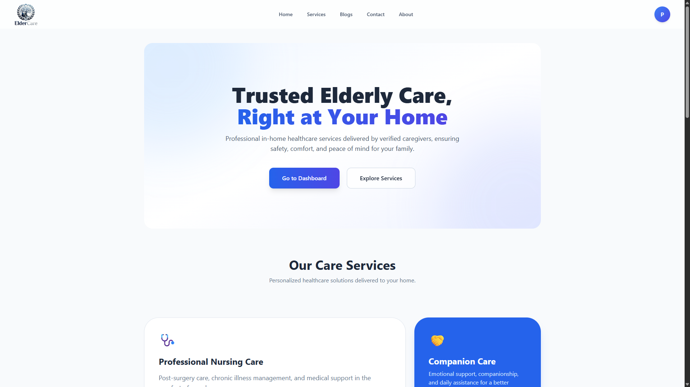
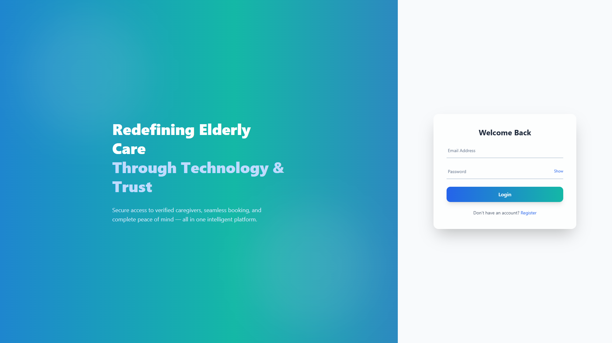
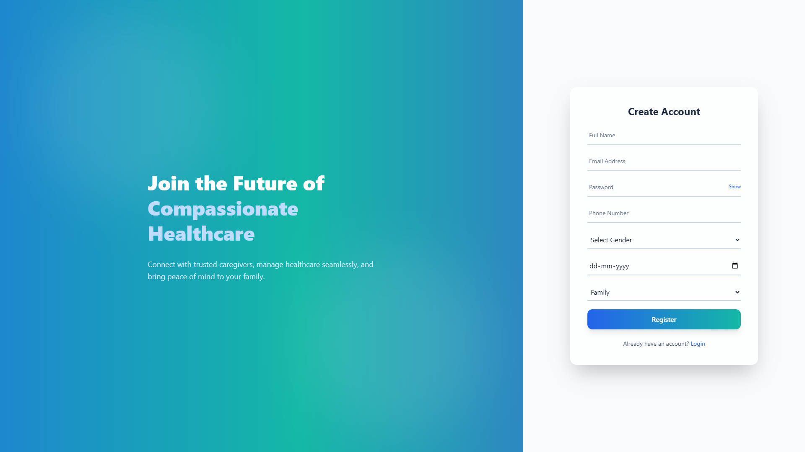
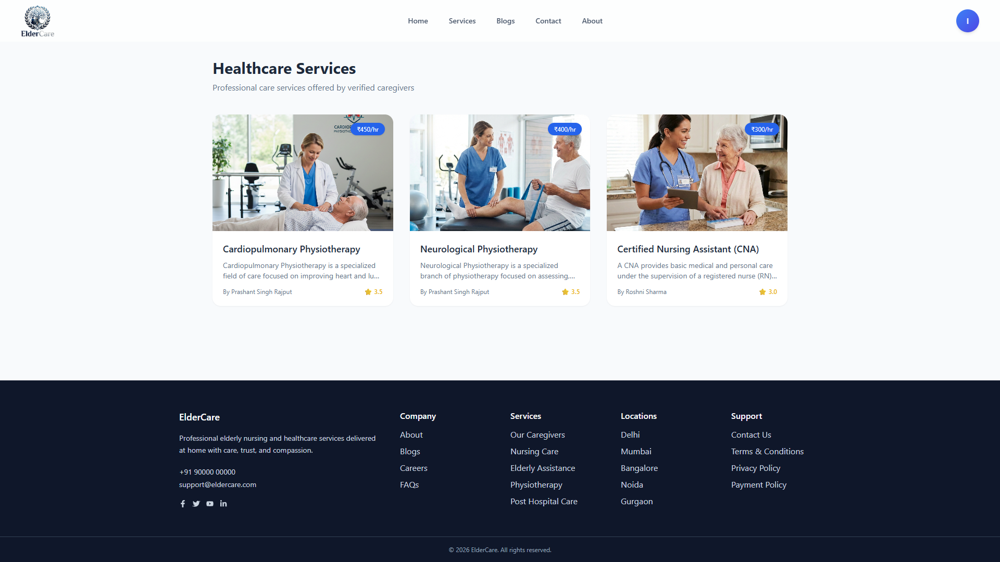
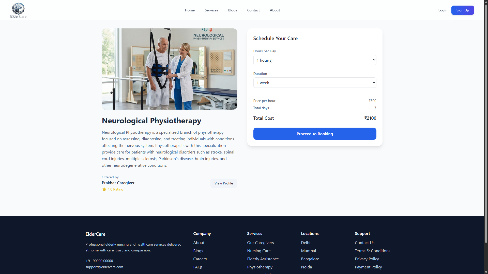
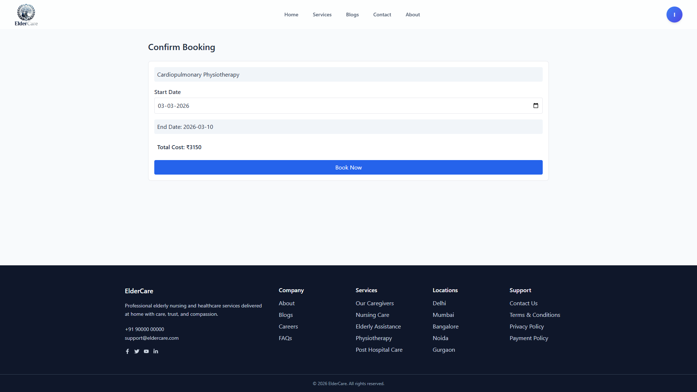
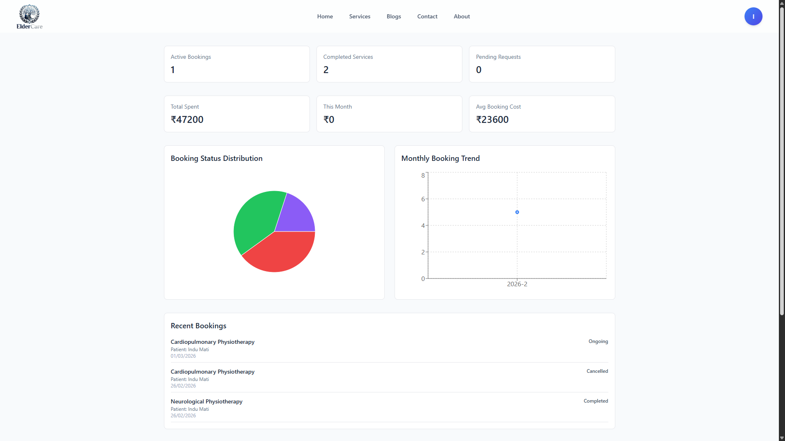
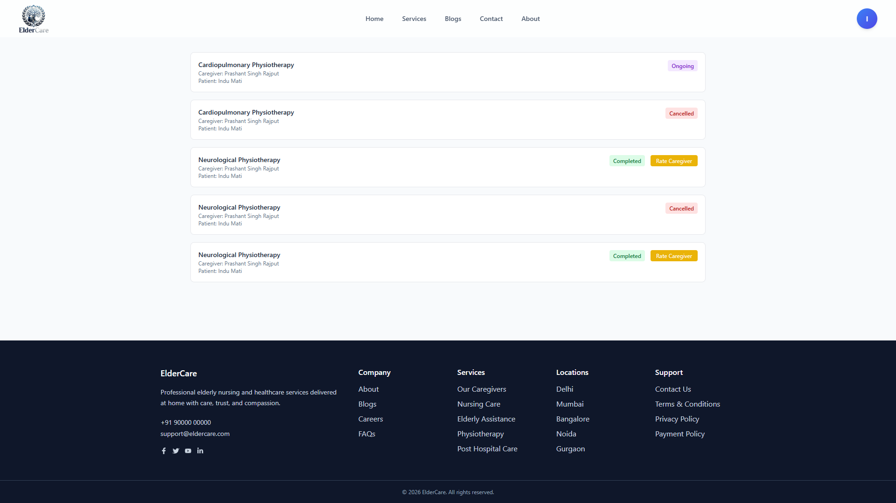

# 🩺 Elderly Nursing & Healthcare Assistance Platform


---

## 📌 Project Overview

The **Elderly Nursing & Healthcare Assistance Platform** is a full-stack web application designed to connect senior citizens and their families with verified healthcare professionals providing in-home medical and non-medical care.

This platform digitizes elderly care services by enabling:

* Secure service booking  
* Caregiver verification  
* Real-time service tracking  
* Structured healthcare coordination  

Developed as part of an internship project and built to production-style standards for portfolio demonstration.

---

## 🚀 Features 

### 🔐 Authentication & Security

* Secure user registration and login (JWT-based)
* Role-based access control (Family / Elderly / Caregiver / Admin)
* Protected routes & secure API validation

---

### 📧 Email Verification System

* Secure email verification before registration
* Token-based verification with expiration handling
* Prevents unverified account creation
* Integrated with transactional email service (Brevo)

---

### 👨‍👩‍👧 User & Patient Management

* Create and manage patient profiles
* Store medical needs & personal details
* View booking history
* Submit caregiver ratings

---

### 🧑‍⚕️ Caregiver System

* Caregiver registration & verification workflow
* Manage availability & service areas
* Accept / reject booking requests
* Update service status lifecycle

---

### 🏥 Service Marketplace

* Browse available healthcare services:
  + Nursing Care
  + Elderly Attendant
  + Physiotherapy
  + Post-Hospital Care
* Transparent hourly pricing
* Caregiver profile preview
* Dynamic booking cost calculation

---

### 📅 Booking Engine

* Flexible care scheduling (start date, duration, hours per day)
* Supports short-term and long-term care planning
* Service status tracking:
  + Requested
  + Accepted
  + Ongoing
  + Completed
  + Cancelled
* Real-time updates using Socket.io

---

### 📝 Care Notes System

* Caregivers can log visit-level care updates
* Tracks patient condition, observations, and notes
* Provides transparency to families
* Enhances continuity of care

---

### ⭐ Rating System

* Post-service caregiver rating
* Average rating calculation & display

---

### 📩 Contact & Support System

* Users can submit queries, feedback, or complaints
* Admin panel to view and manage submitted messages
* Acts as a basic complaint handling mechanism

---

### 📊 Dashboard Overview

* Active bookings
* Completed services
* Pending requests
* Basic analytics summary (bookings, caregivers, satisfaction rate)

---

## 📸 Application Preview

### Home Page



### 🔑 Login Page



### 📝 Register Page



### 🏥 Service Marketplace



### 📄 Service Details



### 📅 Booking Page



### 📊 User Dashboard



### 📖 My Bookings



---

## 🔄 System Workflow

1. User registers or logs in  
2. Verifies email before account activation  
3. Creates patient profile  
4. Browses healthcare services  
5. Configures schedule & duration  
6. Sends booking request  
7. Caregiver accepts request  
8. Service progresses through defined stages  
9. User receives real-time updates  
10. Service completion & rating submission  

---

## 🧱 Core Modules

* Authentication System  
* Role-Based Access Control  
* Email Verification System  
* Patient Management  
* Caregiver Management  
* Service Marketplace  
* Booking Engine  
* Carenote System
* Real-Time Status Updates  
* Rating System 
* Contact & Support Module  
* Responsive UI (Mobile-Friendly)

---

## 🏗 System Architecture

```
Frontend (React + Tailwind)
↓ REST APIs
Backend (Node.js + Express)
↓
MongoDB Database
↕
Socket.io (Real-Time Updates)
```

---

## 🗄 Database Entities

* Users  
* Patients  
* Caregivers  
* Services  
* Bookings  
* EmailVerification  
* CareNotes  
* Ratings  

---

## ⚙️ Tech Stack

### Frontend

* React.js
* Tailwind CSS
* Framer Motion
* Axios
* React Router

### Backend

* Node.js
* Express.js
* MongoDB
* JWT Authentication
* REST APIs
* Socket.io
* Brevo (Transactional Email API)

---

## 🔐 Security Implementation

* JWT-based authentication
* Role-based route protection
* Email verification before account creation
* Booking ownership validation
* Caregiver authorization checks
* Protected API endpoints

---

## 🚧 Future Planned Constraints

The following modules are identified for future expansion:

* 💳 Online Payment Integration
* 🌍 Multi-City Scalability Support
* 📱 Native Mobile Application
* 🆘 Emergency SOS Module
* 📞 Tele-consultation Support

---

## 🛠 Installation & Setup

### Clone Repository

```bash
git clone https://github.com/Prakhar007Pathak/elderly-healthcare-platform.git
cd elderly-healthcare-platform
```

### Backend Setup

```bash
cd backend
npm install
```

### Backend Environment Variables

Create a `.env` file inside the `backend` directory and configure the following variables:

```env
PORT=5000
MONGO_URI=your_mongodb_connection_string
JWT_SECRET=your_jwt_secret_key

# Admin auto-seed credentials
ADMIN_EMAIL=your_admin_email
ADMIN_PASSWORD=your_admin_password
ADMIN_NAME=Admin

# Cloudinary (Image Upload Service)
CLOUDINARY_CLOUD_NAME=your_cloud_name
CLOUDINARY_API_KEY=your_api_key
CLOUDINARY_API_SECRET=your_api_secret

# Brevo (Email Verification Service)
BREVO_API_KEY=your_api_key

API_URL=http://localhost:5000
CLIENT_URL=http://localhost:5173

```

Start backend server:

```bash
npm start
```

### Frontend Setup

```bash
cd frontend
npm install
npm run dev
```

### Frontend Environment Variables

Create a `.env` file inside the `frontend` directory:

```env
VITE_API_URL=http://localhost:5000/api
```

---

## 🌐 Live Deployment

The project is fully deployed and accessible online.

| Service | URL |
|-------|------|
| Frontend (Vercel) | https://eldercare-delta.vercel.app |
| Backend API (Render) | https://eldercare-kodl.onrender.com |

You can explore the platform through the frontend application.  
The backend API is connected to MongoDB Atlas and handles authentication, bookings, services, and real-time updates.

---

## 📈 Expected Impact

* Improved accessibility to verified elderly care

* Transparent pricing & scheduling

* Reduced caregiver search time

* Structured home healthcare management

* Increased trust & service reliability

---

## 👨‍💻 Author

Prakhar Pathak

Full Stack Developer | 2nd year (AI & ML) Student

Passionate about building scalable, real-world web applications.

🔗 GitHub: https://github.com/Prakhar007Pathak

---
